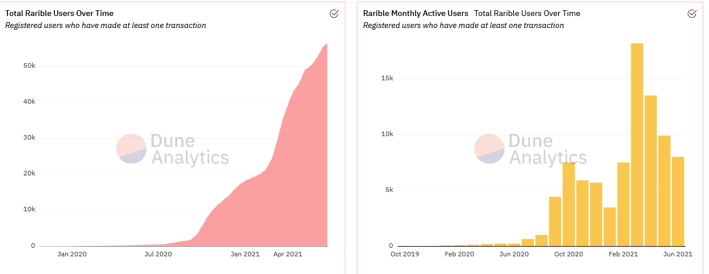

# **OpenSea-Case-Study**

%20-%20thumb.png)

## *[OpenSea](<https://opensea.io/>),`"The Wrold's first and largest digital marketplace for crypto collectibles and non-fungible tokens (NFTs). Buy, sell, and discover exlusive digital assets."`*

>*`"Navigate the uncharted waters of non-fungible tokens."`*
---

## **The Story**

> ## OpenSea beta was launched in December 2017 by [Devin Finzer](https://www.linkedin.com/in/dfinzer/) and [Alex Atallah](https://www.linkedin.com/in/alexatallah). OpenSea was the first open marketplace for non-non-fungible asset on the Ethereum blockchain
>
>> Alex and David witnessed the birth of CryptoKitties in 2017. This was the very first time, that a decentralized application built on blockchains was getting mainstream attention. This period represented a shift in how we view items in the digital world. The mainstream attention around CryptoKitties, lead Devin and Alex to launch Open Sea beta in 2017.

---

> ## ` David Finzer: `
>
> - Studied Computer Science and Mathematics at Brown University
> - Background in Software engineering at Google and Pinterest
> - CoFounder of Claimdog, sold to Credit Karma**
>
> 
---

> ## `Alex Atallah:`
>
> - Studied Computer Science in Stanford University
> - CTO of Hostess.fm, acquired by Beatport in 2014
> - Previous work building cybersecurity products with the company Palantir
>
> 
---

## **Business Activity**

> **OpenSea aims to build and provide tools that allow consumers to trade their assets freely, creators to launch new digital work, and developers to build projects, all this through OpenSea's integrated marketplaces for digital assets.**

OpenSea Creators, Collectors and Buyers

> ## NFT Quick Facts
>
>- NFT stands for Non-fungible token
>
>- NFTs allow you to buy and sell ownership of a digital items
>
>- The blockchain helps keep track who owns those digital items
>
>- NFT can be one of a kind, like a real-life painting
>- NFT can also be one copy of many, like trading cards
>
> ## So what can be an NFT?
>
>- "Anything" Digital
>
>
>>- Drawings
>>- Animated GIF's
>>- Songs
>>- Items in video games
>>- Videos
>>- Other digital files

## According to an article published by [Reuters](https://www.reuters.com/technology/nft-sales-volume-surges-25-bln-2021-first-half-2021-07-05/), the market for NFTs surged to new highs in the second quarter, with a total of $2.5 billion in sales so far this year. Market data also indicates that sales are up from just $13.7 million in the first half of 2020

---

---

## Sales of NFTs on OpenSea are near $150M in the month of June. Additonall graphs published on [Dune Analytics](https://duneanalytics.com/sophieqgu/NFT-Marketplaces) indicate that OpenSea outperforms its competitors, not just in sales. OpenSea is also outperforming in monthly user growth and monthly active users. The second largest competitor in terms of users is Rarible, with a total of over 50K registered users who made at least one transaction. OpenSea has a total of 150k registered users who made at least one transaction

---

---

> ## **A core part of OpenSea's vision is to utilize open protocols like Ethereum and interoperable standards like [ERC-721](http://erc721.org/) and [ERC-115](https://eips.ethereum.org/EIPS/eip-1155) to create new economies.**
>
>
> According to an article ppublished on [TechCrunch](https://techcrunch.com/2021/07/20/nft-market-opensea-hits-1-5-billion-valuation/), OpenSea aims to add and support other blockchain platforms. Several of those are Polygon, Dapper Labs' Flow blockchain, and Tezos
>
> Furthermore, OpenSea has an extensive guide and tutorial for developers on how to build an ERC-721 or ERC-1155 project.Providing and supporting developers is one of main goals of OpenSea. OpenSea is also commited on expanding to a wider NFT community with its commitment to support additonal blockhain platforms

---

## **Competitive and Growing Landscape**  

OpenSea operates in the Non-fungible token landscape, which started back in the year 2012. Here is brief [timeline of NFTs](https://medium.com/@Andrew.Steinwold/the-history-of-non-fungible-tokens-nfts-f362ca57ae10) published on the Medium if you'd like to read more on the history.

The NFT ecosystem is broad and contains many sectors. OpenSeas operates as a Marketplace. its competitors include Dmarket, Makersplace, Rarible, SuperRare, KnownOrigin, and several other players. The world's biggest bitcoin and crypto exchange, [Binance](https://www.binance.com/en/blog/421499824684901995/Introducing-Binance-NFT-A-Groundbreaking-NFT-Marketplace-Launching-June-2021), recently announced its launch of its NFT Market place. Making Binance a large and a key competitor for OpenSea.

## **Tech: Ethereum Token Standard  [ERC-721](http://erc721.org/) and [ERC-115](https://eips.ethereum.org/EIPS/eip-1155)**

For interactions to work properly in the blockchain the Ethereum blockchain has various technical standards for different types of tokens on its network

ERC-721 is a free, open standard that describes how to build non-fungible tokens on the Ethereum blockchain. ERC-721 tokens are all unique, making these tokens rare or one-of-a-kind collectables. In contrast, ERC-1155 utilizes what is known as the Multi Token Standard, which allows for each token identification to represent a new configurable token type, giving it is own set of supply and other attributes

---

## **Tech: [MetaMask](https://metamask.io/)**

MetaMask is a software cryptocurrency wallet that allows users to access the Ethereum blockchain. Through browser extension or mobile apps users can access their Ethereum wallet, which allows users to interact with decentralized applications. OpenSea utlizes Metamask and other wallets

---

## **[Wyvern Protocol](https://github.com/ProjectWyvern)**

OpenSea utilizes the Wyvern Protocol, which are Ethereum smart contracts that are designed for buying and selling digital assets. Project Wyvern smart contracts are security audited and have been used in production with high-volume games.

---

## **OpenSea Fees and Currencies**

According to an article published on [Ivan on Tech Academy](https://academy.ivanontech.com/blog/explaining-opensea-what-is-opensea-and-how-is-it-used), Open Sea takes about 2.5% of the sales price. This fee is low compared to other platforms that take up to 7.5%. Additionally, OpenSea does not charge a service buyers fee, while others charge about 3% on top of the sales price

## OpenSea has over 200 payment options, includes stable coins

---

## **Popular NFT Projects**

## [CryptoPunks](https://www.larvalabs.com/cryptopunks)

>- 10,000 unique collectible characters
>
>- Earliest examples of an NFT on the Ethereum blockchain
>
>- Inspiration for the ERC-721 standard
>
>- Total Value of All Sales: 233.69KΞ ($575.33M)

## [CryptoKitties](https://www.cryptokitties.co/)

> - One of the world’s first blockchain games
>
>- Users collect and breed CryptoKitties
>
>- Runs on the Ethereum Blockchain

 

---

## **Funding:**

The peer-to-peer marketplace has raised a total of $127.2M in funding over its 5 rounds. The most resent funding was raised on July 20, 2021, from a Series B round. The funding round lead by [Andressen Horowitz](https://a16z.com/) (a16z) puts the blockchain startup with a valuation of $1.5 billion

> According to Crunbase, OpenSea is funded by 41 investors which include, Michael Ovitz, Kevin Hartz, Dylan Field, Kevin Durant, Ashton Kutcher, and Tobi Lutke

---

---

## **Several Key Metrics for OpenSea:**

The NFT Ecosystem is still in its inception, which can make it extremely difficult to predict and gage impact. But the demand for owning digital assets is growing

>- According to [Dune Analytics](https://duneanalytics.com/sophieqgu/NFT-Marketplaces) OpenSea has over 150k registered users who made at least one transaction
>
>- Largest Marketplace of NFTs which include
>
>>- Art
>>
>>- Music
>>
>>- Domain Names
>>
>>- Virtual Worlds
>>
>>- Trading Cards
>>
>>- Collectibles
>>
>>- Sports
>>
>>- Utility
>
>- $518M in Volume
>
>- OpenSea made up 90% of Monthly ETH Value Transferred by marketplace
>
>- According to data published on Dune Analytics OpenSea has over 100k Monthly transaction count for the Month of June. Shows a steady increase for the month of July

---

## **DappRadar:**

DappRadar provides information and insight on all existing decentralized applications. OpenSea is ranked number 1 in NFT Marketplaces, with an all-time volume of $993.3M and 175,996 traders. DappRadar tracks its data based on 5 of OpenSea Smart contracts.

[DappRadar OpenSea 30 day Statistics:](https://dappradar.com/ethereum/marketplaces/opensea)

- Users: 55.60k wallets engaging with smart contract  on OpenSea
- Transactions: 655.63k transactions made to dapp’s smart contract
- Volume: $310.48M total value going to dapp’s smart contracts
- Balance: $30.40K total value of assets on dapp’s smart contracts

---

---

## **MainStream attention:**

Mainstream acceptance will lead a new wave of investors, creators, and collectors into the NFT ecosystem

>## [Coca-Cola](https://opensea.io/assets/0x455f04c9c54fffa699e9f6b1271e857a1f2bddfa/1/) Friendship Loot Box NFT launch on OpenSea
>
> Coca-Cola is celebrating International Friendship Day with its first ever Coca-Cola NFT loot box. It includes a rare 1 of 1 NFT and other hidden surprises when opened

>## **Mr.Carter [CryptoPunk #6095](https://opensea.io/assets/0xb47e3cd837ddf8e4c57f05d70ab865de6e193bbb/6095)**
>
>[Shawn Carter](https://fortune.com/nfty-50/2021/jay-z/), also known as Jay-Z added Crypto Punk #6095 as his twitter avatar.
>Additionally, Cartar launched an official NFT for his album ['Reasonable Doubt'](https://www.sothebys.com/en/buy/auction/2021/jay-z-x-derrick-adams-heir-to-the-throne-an-nft/heir-to-the-throne?locale=en) which sold for $138,600 USD.

---

## **Recommendations:**

Expanding its Sports marketplace:

According to an article published on Reuters, [Sports and collectible](https://www.reuters.com/technology/nft-sales-volume-surges-25-bln-2021-first-half-2021-07-05/) NFTs are most popular. NBA Top Shot, which offers video highlights of players in forms of NFTs, had over $200M sales volume for the months of February and March.
[Dapper Labs](https://www.dapperlabs.com/) is the company behind the success of [NBA Top Shots](https://nbatopshot.com/) with over 3M+ transactions and over $500M in sales. Additionally, Dapper has partnered with the UFC to bring UFC digital collectibles.
According to NBC sports, NFL is the highest-grossing sports league in the world, with an estimated $16 billion in pre-pandemic revenue in 2019 versus $8.76 billion for the NBA for the 2018-19 season. Partnering with the NFL to bring digital sports cards will help OverSea grow a larger user base.

---

## References

<https://opensea.io/>

<https://docs.opensea.io/docs/developer-tutorials>

<https://news.bitcoin.com/>nft-marketplace-opensea-raises-100-million-firm-becomes-a-blockchain-unicorn/

<https://duneanalytics.com/sophieqgu/NFT-Marketplaces>

<https://www.businesswire.com/news/home/20210727006156/en/Coca-Cola-to-Auction-Its-First-Ever-NFT-Collectibles-on-International-Friendship-Day>

<https://medium.com/@Andrew.Steinwold/the-history-of-non-fungible-tokens-nfts-f362ca57ae10>'

<https://www.reuters.com/technology/nft-sales-volume-surges-25-bln-2021-first-half-2021-07-05/>

<https://www.crunchbase.com/organization/opensea/signals_and_news>

<https://opensea.io/assets/0x455f04c9c54fffa699e9f6b1271e857a1f2bddfa/1>

<https://www.theblockcrypto.com/post/109655/jay-z-puts-a-cryptopunk-nft-as-his-twitter-profile-picture>

<https://opensea.io/assets/0xb47e3cd837ddf8e4c57f05d70ab865de6e193bbb/6095>

<https://academy.ivanontech.com/blog/explaining-opensea-what-is-opensea-and-how-is-it-used>

<https://nbatopshot.com/>

<https://www.sothebys.com/en/buy/auction/2021/jay-z-x-derrick-adams-heir-to-the-throne-an-nft/heir-to-the-throne?locale=en>

<https://fortune.com/nfty-50/2021/jay-z/>

<https://github.com/ProjectWyvern>

<https://dappradar.com/ethereum/marketplaces/opensea>

<https://www.dapperlabs.com/>

<https://profootballtalk.nbcsports.com/2021/03/11/nfl-revenue-drops-from-16-billion-to-12-billion-in-2020/>

<https://decrypt.co/68936/nfl-ready-for-nfts>

<https://techcrunch.com/2021/07/20/nft-market-opensea-hits-1-5-billion-valuation/>

<https://fortune.com/2021/03/18/nft-art-crypto-marketplace-opensea-amazon/>
